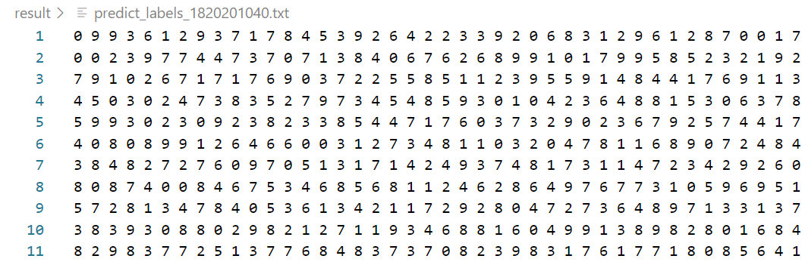
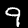
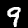
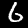
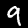
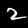
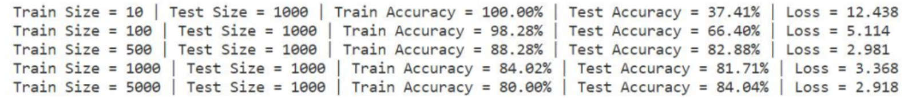
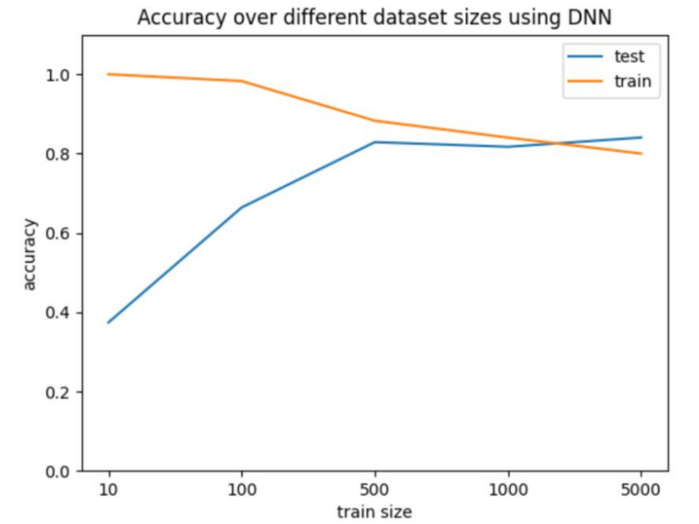
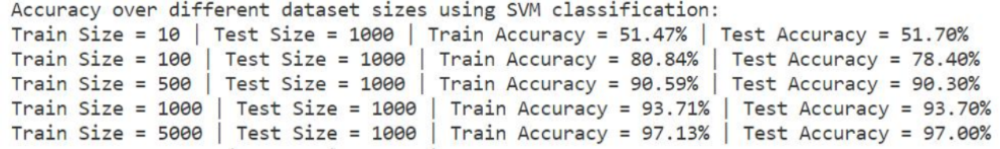
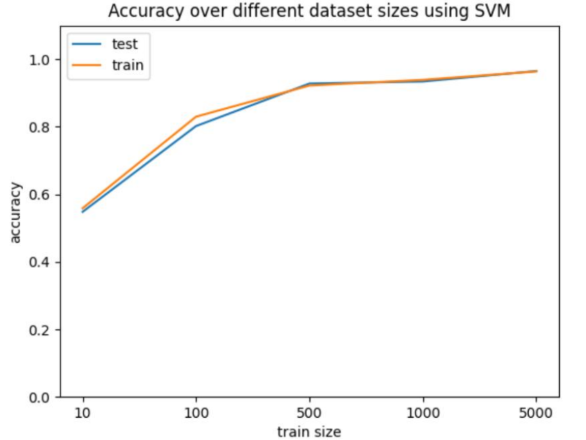

# MNIST-classification
 classification of MNIST using SVM, MLP and CNN

## CNN Result

 

| 1     |  |  |  |  |  |  |  |  |  |  |  |  |
| ----- | ------------------------------------------------------------ | ------------------------------------------------------------ | ------------------------------------------------------------ | ------------------------------------------------------------ | ------------------------------------------------------------ | ------------------------------------------------------------ | ------------------------------------------------------------ | ------------------------------------------------------------ | ------------------------------------------------------------ | ------------------------------------------------------------ | ------------------------------------------------------------ | ------------------------------------------------------------ |
| **2** |  |  |  |  |  |  |  |  |  |  |  |  |
| **3** |  |  |  |  |  |  |  |  |  |  |  |  |
| **4** |  |  |  |  |  |  |  |  |  |  |  |  |
| **5** |  |  |  |  |  |  |  |  |  |  |  |  |

 

| Epoch | Train Accuracy | Train Loss | Val Accuracy |
| :---: | :------------: | :--------: | :----------: |
| 1     | 0.9017         | 0.3166     | 0.9533       |
| 2     | 0.9592         | 0.1339     | 0.9563       |
| 3     | 0.9673         | 0.1057     | 0.9679       |
| 4     | 0.9693         | 0.1009     | 0.9672       |
| 5     | 0.9721         | 0.0917     | 0.9725       |

 

## MLP Result

| Train Result                                           |  |
| ------------------------------------------------------ | ------------------------------------------------------------ |
| **Accuracy graph over train dataset and test dataset** |  |

 

##  SVM Result

| Train Result                                           |  |
| ------------------------------------------------------ | ------------------------------------------------------------ |
| **Accuracy graph over train dataset and test dataset** |  |

 

